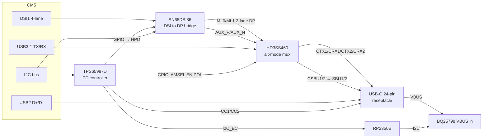

# Minerva Dock Port — Single USB-C with DP Alt Mode

Goal: one USB-C receptacle on the enclosure that does everything, Switch-style:

- **Charging** (PD sink, up to 5 A) into the BQ25798
- **Flashing** via `nRPI_BOOT` (bootrom enumerates as a USB 2.0 device — USB2 D± only)
- **USB 3.0 host data** (the spare CM5 USB3 lane; the other one stays on the WWAN M.2)
- **Video out** as DisplayPort Alt Mode (2-lane DP 1.2 HBR2 + USB 3.0 simultaneously)

Verified against: `sn65dsi86.pdf` (SLLSEH2C), `tps65987d.pdf`, `hd3ss460.pdf`,
`max98357a.pdf`, `slvae16-tps6598x-dp-altmode-appnote.pdf` — all in `../datasheets/`.

## Why not HDMI→DP conversion

BCM2712 has no DP and no native alt mode; outputs are 2× HDMI + 2× DSI. Every
HDMI→DP *source-side* converter is proprietary Asian silicon with NDA docs and
dead distribution (checked 2026-07-18):

| Part | Status at LCSC |
|---|---|
| Lontium LT6711A (C2764459) | "Not available now — not recommended for new designs" (EOL) |
| ITE IT6564 | not listed |
| Algoltek AG9411 | not listed |
| Corechips CS5801 | not listed |

**The escape hatch:** the upper display moved to **HDMI0** (Waveshare 5.5" 2K,
1440×2560), and the lower 480p display uses at most one DSI (or DPI/GPIO).
That frees **DSI1** — and TI's **SN65DSI86** bridges MIPI DSI → DP 1.2 natively.
Fully public datasheet, mainline Linux driver (`drivers/gpu/drm/bridge/ti-sn65dsi86.c`),
used on Chromebooks for years. No HDMI conversion anywhere in the chain.

## Port / lane budget after this change

| CM5 resource | Assignment |
|---|---|
| HDMI0 | Upper display (1440×2560 via HDMI, touch via I2C/USB) |
| HDMI1 | **spare** (optionally route to dock pogo pads later; not needed for USB-C) |
| DSI0 (MIPI0) | Lower 480p display (or free, if lower panel ends up DPI on GPIO) |
| DSI1 (MIPI1) | → SN65DSI86 → DP for the dock |
| USB3-0 | WWAN M.2 (unchanged) |
| USB3-1 | → HD3SS460 → USB-C SS pins |
| USB2 D± | → USB-C D± directly (data + `nRPI_BOOT` flashing) |
| I2C (e.g. GPIO0/1 or spare bus) | SN65DSI86 control + TPS65987D host port |

## Block diagram

## BOM (LCSC stock checked 2026-07-18)

| Role | Part | Package | LCSC # | Stock | 1-pc price |
|---|---|---|---|---|---|
| DSI→DP bridge | TI **SN65DSI86ZQER** | nFBGA-64 (0.8 mm) | C575556 | 29 | $3.60 |
| PD controller | TI **TPS65987DDJRSHR** | QFN-56-EP 7×7 | C2156396 | 91 | $3.96 |
| Alt-mode mux | TI **HD3SS460RHRT** | WQFN-28-EP 3.5×5.5 | C2150882 | 111 | $1.54 |
| Speaker amp | Diodes **PAM8406DR** (stereo class-D, analog in) | SOIC-16 | C86270 | 8,819 | $0.42 |
| USB-C receptacle | 24P mid-mount (e.g. SHOU HAN "TYPE-C 24P QT 143") | SMD 24-pin | C5156605 | 21,006 | $0.43 |
| Config flash for TPS65987D | any 4 Mbit+ SPI NOR (W25Q40 class) | SOIC/USON | pick at order time | — | ~$0.15 |

Notes:
- **TUSB1046** (active redriver alternative to HD3SS460) is 3,000-MOQ / long lead
  at LCSC — skip it. Traces inside the handheld are short; the passive HD3SS460
  is within budget for HBR2 + USB3 Gen1.
- SN65DSI86 stock is thin (29). Buy the run's worth now.
- All four actives are also stocked at Mouser/DigiKey, so NextPCB can source
  them trivially; the LCSC numbers make JLCPCB assembly direct.
- The current schematic's 16-pin USB2-only receptacle **must** be replaced by a
  full 24-pin part — SS pins don't exist on the 16P connector.

## Hookup — SN65DSI86 (DSI → DP source)

Power: **1.2 V core** (`VCC`, `VCCA`) + **1.8 V I/O** (`VCCIO`, `VPLL`) — two AP2112K
LDOs from 3.3 V (schematic U24 = 1.8 V, U25 = 1.2 V; nets `DP_1V8`/`DP_1V2`).
**No oscillator needed:** `REFCLK` is tied to GND and the DP PLL is fed from the DSI
clock lane (`DACP/N`) — the mainline driver selects this mode automatically when no
`refclk` clock is given in the devicetree.

| SN65DSI86 pin | Connects to |
|---|---|
| DA0P/N … DA3P/N, DACP/N | CM5 MIPI1 (DSI1) data lanes 0–3 + clock, 100 Ω diff, length-matched |
| ML0P/N, ML1P/N | HD3SS460 DP lane inputs (2-lane DP; ML2/ML3 unused, leave NC) |
| AUX_P / AUX_N | HD3SS460 AUX pins (mux routes to SBU1/2 with polarity from POL) |
| HPD | TPS65987D GPIO3 (HPD function) through a **51 kΩ 1 % series resistor** (datasheet requirement; schematic R50) |
| SCL/SDA | CM5 I2C1 (`SCL1`/`SDA1` nets; ADDR=GND → address 0x2C) |
| IRQ | net `DSI86_IRQ` (spare, unrouted) |
| EN | CM5 **GPIO26** (`DSI86_EN` net, 10 k pull-down R55; DT `enable-gpios`) |
| GPIO1–4 | 10 k pull-downs (strap 000 at EN-rise; driver reprograms refclk source over I2C) |
| TEST1/TEST2 | GND; TEST3 → GND via 100 nF (C80) |

Software: mainline `ti-sn65dsi86` DRM bridge + devicetree overlay: DSI host
(RP1 DSI1) → bridge → `dp-connector`. 2-lane HBR2 = 10.8 Gbps raw → 1080p60
(needs ~4.5 Gbps) with headroom; 4-lane DSI at 1.5 Gbps/lane covers it.

## Hookup — TPS65987D (PD + alt-mode policy)

Owns the CC wires. **The CM5's CC1/CC2 nets must be cut from the receptacle** —
today they run straight to the CM5. The CM5 never needs them again: it is
powered from the board's 5 V system rail, not raw VBUS, so it doesn't care
about the negotiated contract; the RP2350B does (it programs the BQ25798 input
current limit from what the TPS reports).

| TPS65987D pin | Connects to |
|---|---|
| C_CC1 / C_CC2 | USB-C receptacle CC1 / CC2 (nothing else on these nets) |
| VBUS | Receptacle VBUS (sense) |
| PP_HV / PP_EXT | not used as the charge path — VBUS routes directly to BQ25798 VBUS input; configure external power path in the TPS GUI |
| PP_CABLE | VCONN source if you ever need e-marked cables (5 A does — populate) |
| SPI_CLK/MISO/MOSI/SSZ | config SPI-NOR flash (holds the firmware region built with TI's **TPS6598x Application Customization Tool**) |
| I2C_EC (I2C1) | RP2350B (event/status: contract, alt-mode state) |
| I2C2 | CM5 I2C (optional runtime visibility from Linux) |
| GPIO (3 pins, assigned in config) | HD3SS460 `AMSEL`, `EN`, `POL` |
| GPIO (1 pin) | SN65DSI86 `HPD` |
| VIN_3V3 / LDO_3V3 | always-on 3.3 V (must be alive on battery so a dead unit can negotiate charging; TPS also self-powers from VBUS for true dead-battery) |

Config (in the TI GUI, per `slvae16` app note): DRP, prefer sink for power,
**DFP data role**, DP alt mode as source, pin assignments C/D (2-lane DP +
USB3). This is exactly the Switch's role split: power sink + video/data source.

## Hookup — HD3SS460 (SS mux)

3.3 V, passive crosspoint. Device-side inputs: USB3-1 TX/RX from CM5 + ML0/ML1
+ AUX from the bridge. Connector side: the four SS pairs + SBU.

| HD3SS460 | Connects to |
|---|---|
| USB SSTXp/n, SSRXp/n | CM5 USB3-1 TX/RX (module has TX coupling; no extra caps device-side per HD3SS460 Fig 3) |
| LnAp/n | SN65DSI86 **ML0** (assignment-D source, Table 3 SLLSEM7D) |
| LnBp/n | SN65DSI86 **ML1** |
| LnCp/n, LnDp/n | **unconnected** in 2-lane combo mode |
| SBU1 / SBU2 | SN65DSI86 AUX_P / AUX_N |
| CTX1/CTX2 | receptacle TX1/TX2 through 100 nF AC caps (C91–C94, mux side) |
| CRX1/CRX2 | receptacle RX1/RX2 direct |
| CSBU1/CSBU2 | receptacle SBU1/SBU2 |
| POL, EN | TPS65987D GPIO2, GPIO4 (EN has 100 k pull-down R57) |
| AMSEL | strapped low (10 k, R56) = combo USB3 + 2-lane DP family |

## nRPI_BOOT through the same port

Unchanged and unaffected: CM5 USB2 D± go straight to the receptacle's D± (both
A6/A7 and B6/B7 positions bridged, standard for a device-orientation-agnostic
port). With the `nRPI_BOOT` jumper low, the bootrom appears as a USB2 device to
whatever host is on the cable. The mux, bridge, and PD controller never touch
D±. The TPS65987D will happily present Rd and take 5 V while you flash.

## Speakers — 2× "2030 cavity" 8 Ω 2 W, fed from the display's audio jack

Audio path: HDMI0 audio → upper display driver board → its 3.5 mm jack →
pigtail into **J22** on the carrier → **U29 PAM8406** (stereo class-D) → speakers.
No I2S, no codec, no CM5 GPIO used; volume is the HDMI/ALSA path volume.

| PAM8406 (U29) | Connection |
|---|---|
| INL / INR | J22 tip / ring via 1 µF series caps (C99/C100) |
| VREF | 1 µF to GND (C101) |
| MODE | +5 V = Class-D (low = Class-AB fallback) |
| ~MUTE / ~SHDN | 100 kΩ pull-ups to +5 V (R71/R72); RP2350B may pull low **open-drain only** — it's a 5 V net |
| PVDD/VDD | +5 V, C95–C98 local |
| ±OUT_L / ±OUT_R | J20 / J21 speakers, BTL — **no series caps, never ground OUT−** |

~1.4 W/ch into 8 Ω at 5 V — fine for the 2 W drivers. The speaker connectors'
4 pins are +/− doubled (pins 1-2 = +, 3-4 = −).

Caveats accepted with this topology: the jack is permanently occupied (no
headphones), the analog pair runs through the hinge next to HDMI/DSI ribbons
(keep it twisted + away from the RF antennas), and mute-on-lid-close must be
done via ~SHDN from the RP2350B rather than ALSA.

## Battery / power tree completion (2026-07-18, review pass)

Full-schematic review fixed the power tree so the board can actually run from
battery. Verified by per-net netlist assertions + ERC 0 errors (baseline was 32).

**Added:**

| Ref | Part | LCSC | Stock | Function |
|---|---|---|---|---|
| U30 | TI **TPS61088RHLR** boost | C87357 | 1,735 | SYS_OUT → **+5v @ 5.1 V/5 A** (the +5v rail previously had NO source). EN tied to SYS = on whenever BATFET on; MODE float = PFM. L3 1.5 µH ≥12 A; FB 182k/56k; FSW 64.9k (~500 kHz); ILIM 100k (11.9 A pk); COMP 8.2k+3.3n; SS 47n; out 4×22 µF |
| U31 | ADI **MAX17048G+T10** fuel gauge | C2682616 | 10,097 | On BQ I2C bus (RP2350B GP6/7), addr 0x36 (BQ25798 = 0x6B). CELL/VDD → BATP, ALRT n/c, QSTRT/CTG → GND |
| J24 | JST-PH 2-pin battery connector | commodity | — | **B+ / B−** (pack is a 2-wire 1S 5000 mAh, no thermistor; replaces bare BT2 symbol) |
| R76/R18/R77 | TS network | — | — | REGN —5.23k— TS —30.1k‖10k— GND: fixed divider **emulates a 25 °C 103AT** so the BQ25798 charges without a pack NTC (TS pin must not float). JEITA is effectively disabled — rely on the BQ's internal die-temp protection (TSHUT) and set conservative charge current in firmware. If a future pack adds an NTC: DNP R77 and land the NTC on `TS` |
| D6 | BAT54 (CM5_GPIO) | commodity | — | Power button → BQ25798 **~QON**: hold >15 s = ship-mode exit/entry; diode isolates the CM5 3.3 V PWR_BUT domain from QON's VBAT-referred pull-up |
| BT3+D7+R75 | ML1220 + BAT54 + 1k (CM5_GPIO) | commodity | — | **CM5 VBAT RTC backup** (was a dangling label). Trickle ≈3.0 V from 3.3v. ML1220 rechargeable ONLY; for CR1220 primary, DNP R75+D7 |
| R85/R86 | 2.2k pull-ups | — | — | New **CM5 ↔ RP2350B I2C link**: CM5 I2C1 (GPIO2/3, also 40-pin header 3/5) ↔ RP2350B GP4/GP5 (nets `SDA_I2C`/`SCL_I2C`) — battery SoC / PD contract relay path to the CM5 (there was previously no data path at all) |

**Defects fixed in the existing schematic:**

1. `+3.3V` (capital) island: BQ STAT + both BQ-I2C pull-ups + charge-LED
   resistor sat on a sourceless net (case-sensitive net split). Power symbols
   renamed to `+3.3v`.
2. **STAT LED miswired**: STAT was strapped to the pull-up rail (charging would
   have collapsed the BQ I2C bus) and the LED chain ran rail→R2→LED→GND
   (always on). Now: 3.3v → R2 → LED → STAT (`CRG_IND_SIG`) — lights while
   charging.
3. **CM5 3.3 V never left the GPIO sheet** (missing label on the sheet-pin
   stub) and **HS +5v was an island** (sheet pin had no hierarchical label
   inside) — display FFC 5 V, OTG load switch, DSI86 LDOs, mux VCC were all
   unpowered. Both rails now verified end-to-end.
4. **J3 (WWAN M.2) PERST# dangled** at root — now driven by CM5 `PCIE_nRST`
   (shared with J4); `FULL_CARD_POWER_OFF#` pulled up (R84 100k → M2_3v3);
   spare RESET/LED pins NC'd.
5. Root stubs on the GPIO sheet's `SDA_I2C`/`SCL_I2C` pins were mislabeled
   `BQ_SDA`/`BQ_SCL` — would have shorted the CM5 I2C onto the BQ bus
   (two masters + RP2350's two ports tied together). Vestigial cross-sheet
   plumbing removed; the bus is GPIO-sheet-local.
6. PWR_FLAGs added (VBUS, VBAT, GPIO_VREF, M2_3v3, SIM_VCC); M.2 socket pin
   types corrected to passive; J2 spare pins NC'd.

Datasheets: `datasheets/tps61088.pdf`, `datasheets/max17048.pdf`.

## Open items / risks

1. **CC handoff** — cutting CM5 CC nets and inserting the TPS65987D changes the
   charging bring-up; the RP2350B must relay the PD contract to the BQ25798
   (ILIM) over I2C. Firmware work on the RP2350B.
2. **TPS65987D needs a config image** — build with TI's customization tool,
   flash the SPI NOR. Budget a debug header (SWD + I2C) for reflashing.
3. **SN65DSI86 is BGA-64 0.8 mm** — fine on the planned 4/6-layer stackup, but
   it forces via-in-pad-free escape routing on layer 1/3.
4. Lower display: if it ends up on **DPI (GPIO)** instead of DSI0, nothing here
   changes; if it needs DSI0, still nothing changes — only DSI1 is claimed.
5. This supersedes CONTEXT.md §5.3's PTN3460 note (that part is DP→LVDS,
   wrong direction; section updated).
6. **Analog hinge crossing** — AUX_L/R from the lid jack to J22 shares the
   hinge with HDMI/DSI; budget a shielded or twisted pigtail and check for TDMS
   whine at bring-up. Fallback: repopulate I2S amps (MAX98357A, C910544) — the
   PCM GPIOs 18/19/21 remain free.

## As built in the schematic (2026-07-18)

All parts are now placed and wired in the KiCad project:

| Ref | Part | Sheet |
|---|---|---|
| U20 | SN65DSI86ZQER | CM5_HighSpeed |
| U21 | HD3SS460RHRT | CM5_HighSpeed |
| U22 | TPS65987DDJRSHR | CM5_HighSpeed |
| U23 | W25Q32JVSS config flash | CM5_HighSpeed |
| U24/U25 | AP2112K-1.8 / AP2112K-1.2 | CM5_HighSpeed |
| U29 | PAM8406DR + J22 aux-in from display jack, J20/J21 speaker connectors, R71/R72, C95–C101 | CM5_GPIO |
| U28 | Waveshare Core2350B module (symbol pins 1–16 = P1, 17–32 = P2, 33–48 = P3, 49–64 = P4 of the wiki pinout) | CM5_GPIO |

Cross-sheet nets (hierarchical labels + root wiring): `CC1`, `CC2`,
`PD_I2C_SDA/SCL/IRQ` (TPS65987D I2C1 ↔ RP2350B GP0/GP1/GP2), `BQ_SDA/BQ_SCL`
(BQ25798 ↔ RP2350B GP6/GP7), `DSI86_EN` (CM5 GPIO26 → bridge EN).
RP2350B also takes `PWR_BUT` (GP10) and `nRPIBOOT` (GP11 — drive low to put the
CM5 in USB-boot for flashing).

Receptacle (added 2026-07-18, second pass): **J23** full-featured 24-pin USB-C
(`Connector:USB_C_Receptacle`, part: SHOU HAN TYPE-C 24P QT 143, C5156605) on
the root sheet, replacing the old 16-pin USB2-only J11. Wiring:

- VBUS ×4 → `VBUS` net (straight to BQ25798 path; R9 2.2 k bleed kept)
- CC1/CC2 → TPS65987D (hierarchical to CM5_HighSpeed) + 390 pF filters
- D± (both orientations) → `USB2_P/N` → CM5 (nRPI_BOOT flashing path intact)
- TX/RX pairs + SBU1/2 → **global labels** `USBC_*` → HD3SS460 on CM5_HighSpeed
  (global labels chosen over 10 sheet pins deliberately — dedicated
  point-to-point SS pairs)
- Shield + GND pins → GND

**CM5 CC cut done with a bring-up escape hatch:** CM5 CC pins now sit on
`CM5_CC1/CM5_CC2`, joined to the port CC nets only through **R73/R74 0 Ω**.
Populate them to bring the board up without the PD controller (CM5 negotiates
5 V as before); **DNP them once the TPS65987D is flashed** — never both active.

Removed: old J11 + its stubs, and the original grounding strap that parked all
six unused `USB3-1-*` signals to GND (`#PWR0136` + 6 wire segments at x=224.79
on CM5_HighSpeed) — USB3-1 now feeds the mux.

Still open on the schematic side: footprints for U20/U21/U22/U28/J23
(placeholders set — J23 needs the QT-143 land pattern), TVS/ESD arrays on
VBUS/USB2/CC/SS per CONTEXT §5.1 (note placed on root sheet), and the
TPS65987D config image.
