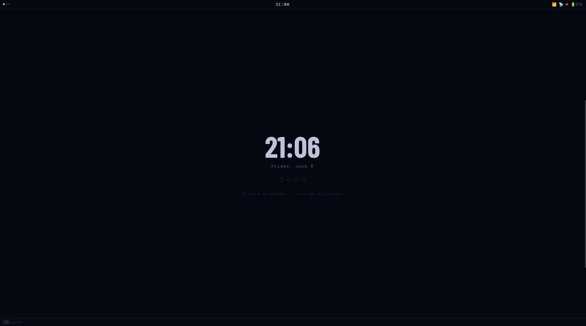
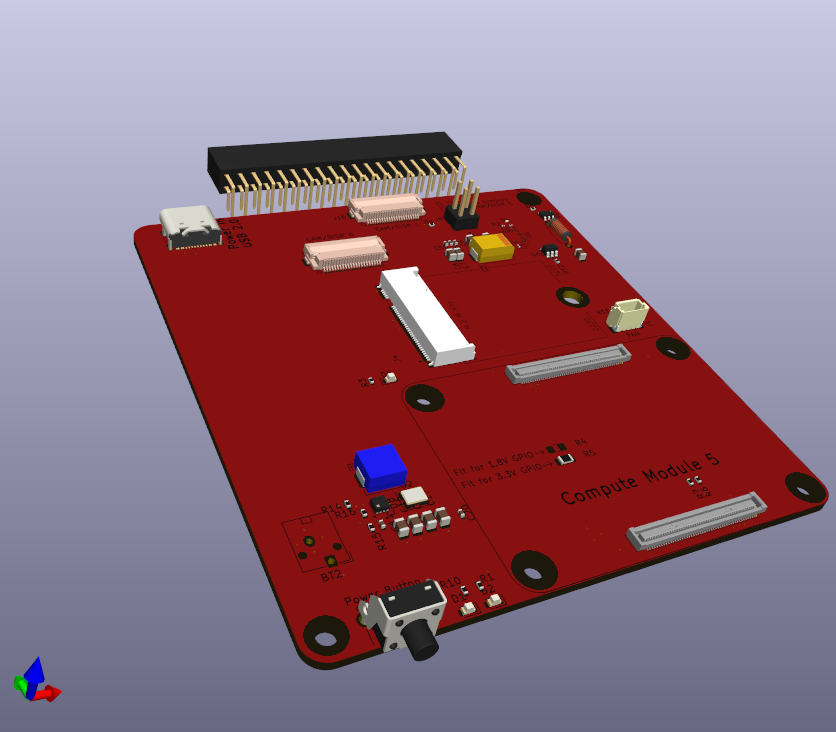
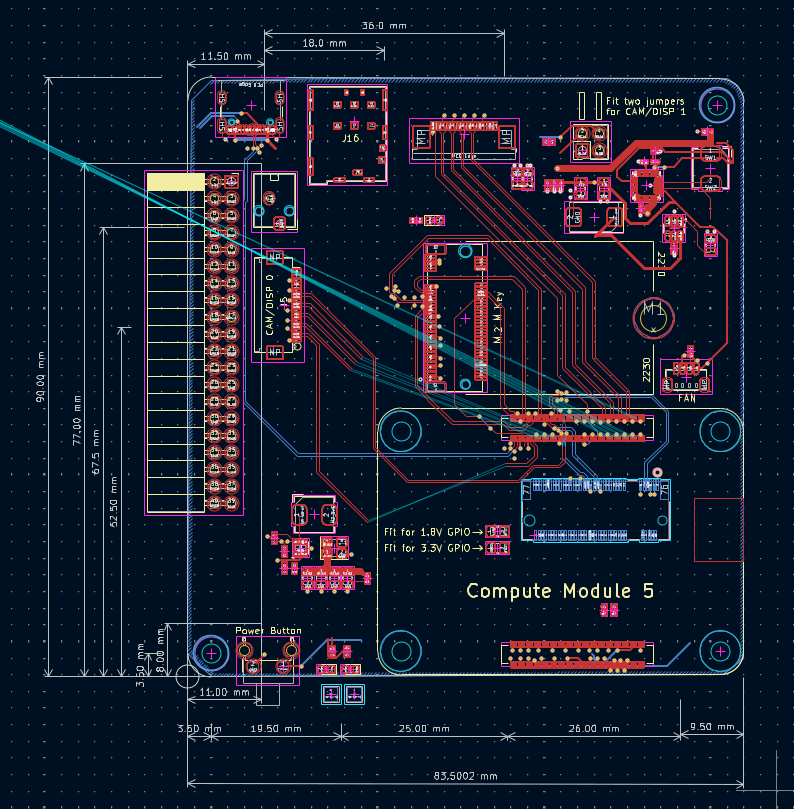
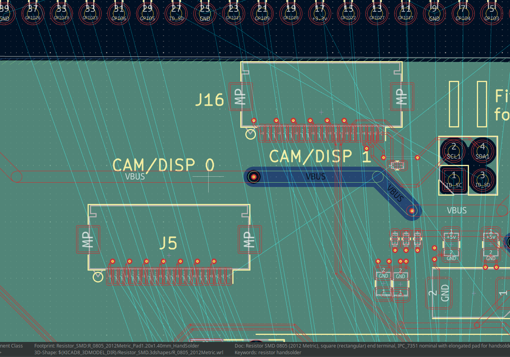

# Project Minerva

A custom clamshell handheld computer built around the Raspberry Pi Compute Module 5. Minerva combines a gaming-controller form factor with a full Linux environment: dual displays, cellular connectivity, NFC/RFID, and a security-first immutable OS. Every layer of software — compositor, shell, applications — is purpose-built for controller-style interaction.

> **Device:** Minerva &nbsp;|&nbsp; **OS:** Minerva OS &nbsp;|&nbsp; **Desktop Environment:** Torchform

---

## Screenshots & Hardware

| | |
|---|---|
|  |  |
| Torchform shell — home grid, status bar, dock | CM5 carrier board 3D render |
|  |  |
| Work-in-progress PCB layout (KiCad 9) | DSI/CSI display and camera connectors |

---

## What It Is

Minerva is not a game console. It is a general-purpose handheld Linux computer designed for an unconventional input paradigm — no keyboard, no precise pointer. The form factor is a direct reference to the New Nintendo 3DS (KTR-001, 2014), matching its footprint almost exactly while adding 8mm of thickness for the CM5 module and a 5000mAh battery.

**Core principles:**
- The hardware serves the software vision, not the other way around
- Security is structural — immutable root, hardware key storage, physical kill switches
- Minimize runtime overhead across the entire stack (musl libc, Rust binaries, Slint UI)
- Every UI interaction is achievable with the controller alone — no mouse or keyboard assumed

---

## Repository Structure

```
Project-Minerva/
├── Minerva-Hardware/          # KiCad 9 project — CM5 carrier board
│   ├── Minerva-Carrier.kicad_pcb
│   ├── Minerva-Carrier.kicad_sch
│   ├── CM5_GPIO.kicad_sch
│   ├── CM5_HighSpeed.kicad_sch  # MIPI DSI, USB 3.0, PCIe
│   ├── PCIe-M2.kicad_sch        # M.2 NVMe slot
│   └── Minerva-Carrier.kicad_sym
├── Project-Minerva-OS/        # Rust workspace — OS, compositor, shell
├── Torchform/                 # Rust workspace — Desktop Environment
├── Notes/
│   ├── Images/                # Hardware renders, UI screenshots, PCB photos
│   └── minerva-console-hardware-spec-v3.docx
├── Manual/
│   └── WWAN.md                # Cellular modem setup guide
├── Docs/                      # Component datasheets (EM7565, etc.)
├── rpi-scripts/               # Alpine Linux setup and provisioning scripts
└── CONTEXT.md                 # Full design reference document
```

Enclosure CAD is in OnShape (cloud), project name "Project Minerva". Not stored in this repo.

---

## Hardware

### Physical Design

Clamshell handheld. Two shells connected by a friction hinge — holds the lid at any angle, with a 130–140° stop to protect flex cables.

| Dimension | Value |
|-----------|-------|
| Width | 145 mm |
| Depth (closed) | 82 mm |
| Total height (closed) | 30 mm |
| Shell wall thickness | 2 mm |
| Corner roundedness | 30° fillets |
| Reference device | New Nintendo 3DS (KTR-001) |

The lower shell is divided by a central structural spine: battery on the left (~5000mAh LiPo pouch), mainboard electronics on the right. The 3.5" lower touchscreen spans across both zones above the hinge.

### Compute Module — Raspberry Pi CM5

| Parameter | Value |
|-----------|-------|
| CPU | ARM Cortex-A76 quad-core, up to 2.4GHz |
| GPU | VideoCore VII — OpenGL ES 3.1, Vulkan 1.2 |
| RAM | 8GB LPDDR4X |
| Storage (eMMC) | 32GB — OS partitions only |
| PCIe | Gen 2 ×1 → NVMe SSD |
| USB | 1× USB 3.0 (WWAN modem) + 1× USB 2.0 (USB-C) |
| Display | 2× MIPI DSI |
| WiFi | 802.11ac dual-band |
| Bluetooth | 5.0 |

### Carrier Board (KiCad 9)

Custom 4-layer carrier board. Key design constraints:
- **CM5 connector:** Hirose DF40C-100DS-0.4V (0.4mm pitch)
- **MIPI DSI:** 90Ω differential pairs, length-matched, away from switching regulators
- **USB 3.0:** 90Ω SuperSpeed differential pairs, minimize vias
- **PCIe (NVMe):** 85Ω differential, AC coupling caps on TX pairs
- **RF traces (NFC, WWAN):** 50Ω microstrip with clean ground plane

| Layer | Purpose |
|-------|---------|
| 1 (Top) | Components and signals |
| 2 | Ground plane — unbroken under RF and high-speed |
| 3 | Power planes (3.3V, 1.8V) |
| 4 (Bottom) | Signals, some components |

### Display System

| Display | Size | Resolution | Interface | Touch |
|---------|------|-----------|-----------|-------|
| Upper (primary) | 5.5" | 1920×1080 | MIPI DSI via hinge FPC | No |
| Lower (companion) | 3.5" | 640×480 | MIPI DSI + I2C touch controller | Yes (capacitive) |

The upper screen is the application viewport. The lower screen is contextual — its content changes based on what is focused on the upper screen (virtual keyboard, radial menus, status info, secondary app views). This is architecturally similar to the Nintendo DS / Wii U GamePad, not a simple extended desktop.

### Input System

| Input | Type | Interface |
|-------|------|-----------|
| Left pad | Cirque GlidePoint circular capacitive (35–40mm) | SPI0 direct to CM5 |
| Right stick | Hall effect analog (TLV493D / AS5600) | I2C via input MCU |
| D-pad | 4-way digital | Input MCU GPIO |
| A, B, X, Y | Digital face buttons | Input MCU GPIO |
| L1, R1 | Digital shoulder buttons | Input MCU GPIO |
| L2, R2 | Analog triggers | Input MCU ADC |
| Start / Select | Digital | Input MCU GPIO |
| Lower screen | Capacitive touch | I2C touch controller |

A dedicated input MCU (RP2040 or STM32F0) handles button scanning, debouncing, and ADC. The Cirque trackpad connects directly to CM5 SPI0 via the `cirque_pinnacle` mainline kernel driver.

#### Input Grammar

| Input | Action |
|-------|--------|
| Left pad (Cirque) | Cursor / navigation |
| D-pad | Spatial focus movement between UI elements |
| A | Confirm / select |
| B | Back / cancel |
| L2 (hold) | App radial menu — layer 1 |
| R2 (hold) | App radial menu — layer 2 |
| L2 + R2 (hold) | Global system radial menu |
| Select | Command palette |
| Start | App switcher |
| L1 / R1 | Switch tiles (split-screen mode) |

### Storage

| Storage | Use | Encryption |
|---------|-----|-----------|
| eMMC 32GB (on CM5) | OS only — immutable boot image | dm-verity (read-only root) |
| M.2 2230 NVMe (PCIe ×1) | All user data | LUKS2 AES-256-XTS, key from ATECC608B |

### Connectivity

| Radio | Source | Notes |
|-------|--------|-------|
| WiFi 5 | CM5 onboard | MAC randomization on every association |
| Bluetooth 5.0 | CM5 onboard | BLE + Classic |
| WWAN 5G/LTE | Quectel RM520N-GL or EC25-AF | M.2 B-key, USB 3.0 interface |
| NFC (13.56MHz) | NXP PN7150 (I2C) | MIFARE, ISO 14443, HCE |
| 125kHz RFID | Separate module (EM4100/HID Prox) | On main board |

### Power

- Battery: 5000mAh Li-Po single cell
- Charging: USB Power Delivery (5V/3A or 9V/2A fast charge)
- Fuel gauge: BQ27441 or MAX17048 (coulomb counter)
- PMIC: TPS65219 or similar (3.3V, 1.8V, 1.0V rails)
- Clamshell detection: DRV5023 hall effect sensor → suspend on close, wake on open

### Security Hardware

| Component | Purpose |
|-----------|---------|
| ATECC608B | Hardware secure element — LUKS key derivation, ECDH, HMAC-SHA256, anti-rollback counter |
| Optional: Infineon SLB9670 TPM 2.0 | Measured boot, PCR attestation, key sealing |

**Hardware kill switches** (physical slide switches, software cannot override):
- Microphone power rail
- Camera power rail (future)
- All radios (WiFi + BT + WWAN) simultaneously

### Optional Daughterboard (RF + Biometrics)

Attaches via FPC or pin header — can be omitted from the base build.

| Component | Chip | Notes |
|-----------|------|-------|
| Sub-1GHz RF | TI CC1101 | 300–928MHz, ASK/OOK/FSK — same IC as Flipper Zero |
| Infrared TX/RX | IR LED + TSOP38238 | NEC, RC5, Sony SIRC, LIRC stack |
| Fingerprint | Goodix GT9368 | `libfprint` / `fprintd`, always has PIN fallback |

---

## Software

### Minerva OS

**Base:** Alpine Linux, musl libc, OpenRC init system  
**Rust target:** `aarch64-unknown-linux-musl`

#### Boot Chain

```
Power on
  → U-Boot (signed, eMMC partition 1)
    → Verify Slot A via dm-verity hash tree
      → Success: Mount read-only rootfs + overlayfs (config partition)
        → OpenRC → derive LUKS key via ATECC608B → unlock NVMe
          → Mount ZFS volumes → Launch Torchform
      → Failure: Boot Slot B recovery
```

#### Storage Layout

| eMMC Partition | Purpose |
|----------------|---------|
| 1 — Bootloader | U-Boot, signed, read-only |
| 2 — Slot A | Minerva OS verified image (dm-verity, ~4GB) |
| 3 — Slot B | Recovery OS (minimal, read-only, ~2GB) |
| 4 — Boot config | A/B selector, U-Boot environment |
| 5 — Overlay | Writable overlayfs upper layer for `/etc` |

| NVMe Volume (inside LUKS2) | Mount |
|---------------------------|-------|
| Home | `/home/user` |
| Data | `/data` |
| Logs | `/var/log` |
| Swap | `[swap]` |

ZFS is used on the NVMe for snapshots, checksumming, and compression.

#### System Services

| Service | Purpose |
|---------|---------|
| `torchform-compositor` | Smithay Wayland compositor (two outputs) |
| `torchform-inputd` | uinput virtual gamepad + Cirque axis synthesis |
| `pipewire` | Audio server (replaces PulseAudio) |
| `NetworkManager` | WiFi, cellular, VPN |
| `ModemManager` | WWAN modem |
| `neard` / `nfcd` | NFC daemon |
| `whisper.cpp` | On-device speech-to-text (command palette, text fields) |
| `fprintd` | Fingerprint auth (when daughterboard attached) |

---

### Torchform — Desktop Environment

Torchform is a custom Rust DE built entirely for Minerva's controller input paradigm. No GNOME, KDE, or existing DE is used.

See [Torchform/TORCHFORM.md](Torchform/TORCHFORM.md) for full documentation.

#### Technology Stack

| Layer | Technology |
|-------|-----------|
| UI toolkit | Slint (declarative, Rust-native, CSS-adjacent theming) |
| Compositor | Smithay (Rust Wayland compositor library) |
| Input daemon | Custom `torchform-inputd` (Cirque SPI, USB HID, uinput) |
| Design tokens | `tokens.slint` — single source of truth for all theming |

#### Crate Map

| Crate | Role |
|-------|------|
| `torchform-shell` | Main Slint UI — N3DS chrome, overlays, state machine |
| `torchform-apps` | All 12 app UI components (embeddable or standalone) |
| `torchform-compositor` | Smithay two-output compositor, tiling, input |
| `torchform-inputd` | Cirque SPI, USB HID gamepad, uinput, Unix socket |
| `torchform-actions` | `ShellAction` enum + `InputMap` keybinds (no Slint dep) |
| `torchform-config` | `TorchformConfig` TOML loader + settings schema (no Slint dep) |
| `torchform-settings` | Standalone Settings app |
| `torchform-files` | Standalone File Browser app |
| `torchform-terminal` | Writes themed Alacritty/Kitty config then `exec()`s terminal |
| `torchform-run` | Sets Wayland env vars then `exec()`s any app binary |

#### Shell UI

The shell presents a Nintendo-3DS-style chrome on the upper display:

- **Status bar** (top, 28px) — workspace dots, clock, battery, now-playing, notifications indicator
- **Home screen** — 7-app grid + 5-icon dock + search bar
- **App window** — fullscreen or horizontal split (2 tiles max); no floating windows
- **Quick Settings** — right-slide panel; sliders + toggle tiles
- **Notifications** — left-slide panel; notification list
- **App Switcher** — full-screen card row (Start button)
- **Command Palette** — searchable command list (X button)
- **Radial Menus** — primary action pattern; L2/R2 open layers 1/2, L2+R2 opens global system menu
- **Hint bar** (bottom, 24px) — contextual button hints

The lower companion display shows: virtual keyboard, radial menus, status widgets, app-specific secondary content, or idle status (battery, time, quick toggles).

#### App Suite

All apps are Slint + Rust, designed for controller input (no keyboard/mouse assumptions):

| App | Status |
|-----|--------|
| Settings | Working (schema-driven, sliders/toggles/selects) |
| File Manager | Working (directory navigation, file sizes, icons) |
| Terminal | Working (launches Alacritty or Kitty with themed config) |
| System Monitor | UI ready; backend polling not yet implemented |
| Package Manager | UI ready; backend not yet implemented |
| Log Viewer | UI ready |
| Notes | UI ready |
| Network Manager | UI ready; no backend integration |
| Web Browser | Planned (Servo embedded or Chromium kiosk) |
| Media Player | Planned (mpv backend) |
| Phone / SMS / Email | UI components ready; no backend |
| Camera | Planned (future — hardware not in initial scope) |

**App design constraints** (all apps must follow):
- No dropdown menus — use enumeration pickers (cycle with A/B or D-pad)
- No text fields requiring a physical keyboard — use voice (Whisper.cpp) or lower-screen virtual keyboard
- UI controls limited to: sliders, checkboxes, enumeration pickers
- Every interactive element reachable by D-pad spatial navigation
- Fullscreen layout (1920×1080 upper screen primary viewport)
- Every app defines what it shows on the lower 3.5" screen

#### Quick Start — Desktop Development (No Hardware Required)

```bash
# Build and run the shell emulator (single window with both displays)
cd Torchform
cargo run -p torchform-shell

# Demo modes:
cargo run -p torchform-shell -- --demo radial     # radial menu open
cargo run -p torchform-shell -- --demo switcher   # app switcher open
cargo run -p torchform-shell -- --demo idle       # lower screen idle state

# Two separate windows (mirrors physical layout)
cargo run -p torchform-shell -- --standalone

# Makefile shortcuts:
make run-emulator
make run-standalone
make check          # fast type-check (no hardware libs needed)
make build-all      # full workspace (needs libseat, libinput, libgbm)
```

**Emulator keyboard shortcuts:**

| Key | Action |
|-----|--------|
| Space | Select / go home |
| Enter | Start / app switcher |
| Tab (hold/release) | L2 — radial menu |
| Esc | B — back/cancel |
| A | A — confirm |
| X | Command palette |
| Z | Quick Settings |
| C | Notifications |
| Arrow keys | D-pad |
| I / J / K / L | Analog stick N/W/S/E |

**System dependencies (Debian/Ubuntu):**
```bash
sudo apt-get install \
    libseat-dev libinput-dev libgbm-dev libdrm-dev \
    libudev-dev libxkbcommon-dev libwayland-dev \
    libx11-dev libx11-xcb-dev libevdev-dev \
    pkg-config build-essential
```

---

### Minerva OS — Rust Workspace

See [Project-Minerva-OS/README.md](Project-Minerva-OS/README.md) for full build documentation.

```bash
cd Project-Minerva-OS
make build        # cross-compile all crates for ARM64
make image        # build full disk image
make run          # test in QEMU ARM64
make deploy-bins  # push updated binaries to CM5 over SSH
```

---

## Development Status

| Subsystem | Status |
|-----------|--------|
| Carrier board schematic | In progress |
| Carrier board PCB layout | In progress — diff pair routing active |
| Enclosure CAD (OnShape) | In progress |
| Torchform shell emulator | Working — run `make run-emulator` |
| Radial menu UI | Working |
| Command palette UI | Working |
| App switcher UI | Working (display only) |
| Settings app | Working |
| File manager | Working |
| Input virtualization (`ShellAction` + `InputMap`) | Working |
| Wayland compositor (Winit backend) | Working |
| Wayland compositor (DRM/KMS) | Stub — pending hardware |
| Input daemon (Cirque SPI) | Written — requires CM5 hardware |
| System actions (brightness, volume, WiFi) | UI complete; no backend syscalls |
| App switcher close/switch logic | Not yet implemented |
| Sysmon, Pkgman, Logview backends | Not yet implemented |
| Phone / SMS / Email backends | Not yet implemented |
| Alpine OS image build | In progress |
| LUKS + ATECC608B key derivation | Design complete |

---

## Open Questions

**Hardware:**
1. Cirque trackpad: TM035035 (35mm) vs TM040040 (40mm) — depends on physical fit
2. L2/R2 analog vs digital triggers — analog preferred for gaming, adds ADC complexity
3. Fan vs passive cooling — thermal testing needed with CM5 under load
4. Input MCU: RP2040 vs STM32F0 (RP2040 cheaper + USB HID; STM32F0 has better ADC)
5. Daughterboard connector: FPC vs pin header

**Software:**
6. App sandboxing model: containers (LXC/Podman) vs Wayland-only isolation vs seccomp-bpf vs hybrid
7. Workspace persistence: how `workspace.toml` files are managed and discovered
8. OS update mechanism: how Slot A images are built, signed, and deployed (OTA vs USB flash)
9. Whisper.cpp model size: tiny / base / small (accuracy vs CPU tradeoff on CM5)
10. Lower screen display server: distinct Wayland output vs managed Slint surfaces

---

## Key References

- [CONTEXT.md](CONTEXT.md) — full design reference (physical, hardware, OS, DE)
- [Torchform/TORCHFORM.md](Torchform/TORCHFORM.md) — Torchform DE documentation
- [Torchform/CLAUDE.md](Torchform/CLAUDE.md) — Torchform Claude context (architecture deep-dive)
- [Manual/WWAN.md](Manual/WWAN.md) — Cellular modem setup
- [Docs/](Docs/) — Component datasheets
